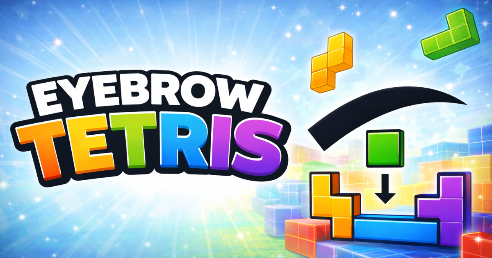

# Eyebrow Tetris

**Play Tetris with your face.** Raise your eyebrows to move pieces, open your mouth to drop.

A free, browser-based Tetris game powered by AI webcam face detection. No download needed.

<p align="center">
  <a href="https://eyebrow-tetris.sanderdesnaijer.com">
    
  </a>
</p>

<p align="center">
  <a href="https://eyebrow-tetris.sanderdesnaijer.com"><strong>Play Now</strong></a>
</p>

## Controls

| Gesture | Action |
|---------|--------|
| Left eyebrow up | Move left |
| Right eyebrow up | Move right |
| Both eyebrows up | Rotate |
| Open mouth | Soft drop |
| Both brows + mouth | Hard drop |

Keyboard backup: WASD / Arrow keys also work.

## Features

- **Face-controlled gameplay** — webcam + MediaPipe reads your eyebrow and mouth movements in real time
- **Global leaderboard** — submit scores and compete daily
- **Progressive difficulty** — speed increases with each level
- **Responsive** — works on desktop and mobile
- **Privacy-first** — camera data never leaves your browser

## Tech Stack

- **Framework**: Next.js 16 (App Router, static export)
- **Styling**: Tailwind CSS v4
- **Face Detection**: MediaPipe Face Landmarker
- **Database**: Supabase (leaderboard)
- **Hosting**: GitHub Pages

## Development

### Prerequisites

- Node.js 20+
- npm

### Setup

```bash
git clone https://github.com/sanderdesnaijer/eyebrow-tetris.git
cd eyebrow-tetris
npm install
cp .env.example .env.local
npm run dev
```

Open [http://localhost:3000](http://localhost:3000).

Optionally, set up Supabase for the leaderboard:

1. Create a project at [supabase.com](https://supabase.com)
2. Run the SQL from `supabase-schema.sql` in the SQL Editor
3. Copy your project URL and anon key to `.env.local`

## Deployment

Pushes to `main` auto-deploy to GitHub Pages.

**GitHub Secrets** (required for leaderboard):

- `NEXT_PUBLIC_SUPABASE_URL`
- `NEXT_PUBLIC_SUPABASE_ANON_KEY`

## Project Structure

```
src/
├── app/
│   ├── page.tsx           # Home page with game
│   ├── leaderboard/       # Leaderboard page
│   ├── how-to-play/       # Instructions
│   ├── privacy/           # Privacy policy
│   └── changelog/         # Version history
├── components/
│   ├── GameScreen.tsx     # Camera + face detection
│   ├── TetrisOverlay.tsx  # Tetris game logic
│   ├── Navigation.tsx     # Site navigation
│   └── ScoreSubmitModal.tsx
└── lib/
    ├── supabase.ts        # Database client
    └── github.ts          # GitHub releases fetcher
```

## Versioning

Uses [Conventional Commits](https://www.conventionalcommits.org/) with automatic semantic versioning:

- `feat:` — minor bump
- `fix:` — patch bump
- `BREAKING CHANGE:` — major bump

## Privacy

Camera data is processed entirely in the browser. No video is ever sent to any server. Only leaderboard data (nickname + score) is stored. See the [Privacy Policy](https://eyebrow-tetris.sanderdesnaijer.com/privacy).

## License

MIT
